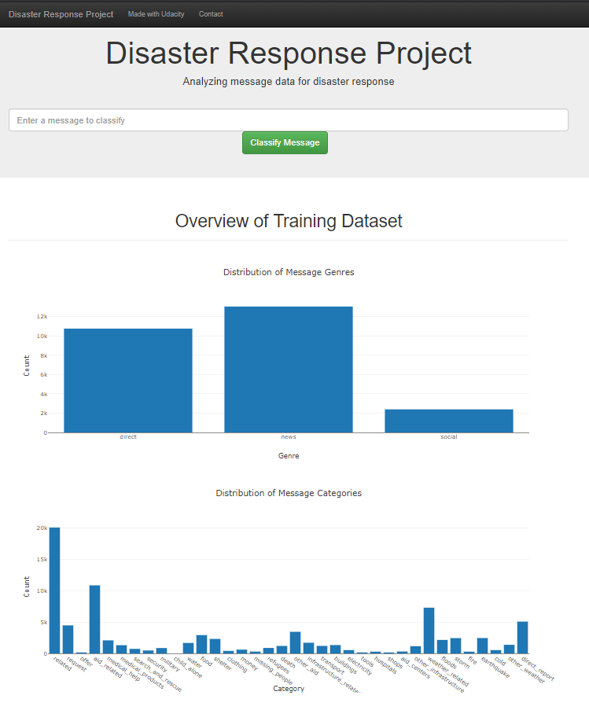
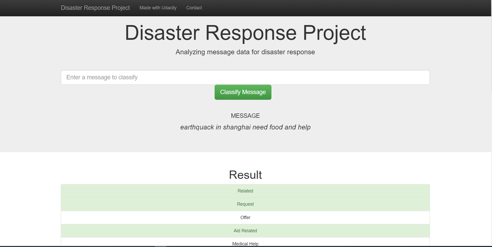

# Disaster_response
Disaster Response pipeline

#### Table of contents
1. [Description](#description)
2. [Requirements](#requirements)
3. [Folder Structure](#folder)
4. [Steps](#steps)
5. [Screenshots](#screenshots)
6. [Acknowledgement](#acknowledgement)

<a name="description"></a>
## Descripton
In the Disaster Response pipeline, you'll find a data set containing real messages that were sent during disaster events. You will be creating a machine learning pipeline to categorize these events so that you can send the messages to an appropriate disaster relief agency.
It Machine learning pipeline used in this project is capable enough to categorize message to their respective categories.Front end of web application is based on Flask.For backend we have use SQLite3
Thanks Udacity for Providing such a interesting Work with students.

<a name="requirements"></a>
## Requirements
* Python 3.6
* Machine Learning Libraries: NumPy, SciPy, Pandas, Sciki-Learn
* Natural Language Process Libraries: NLTK

<a name="folder"></a>
## folder Structure 
```- app
  | - project
    | - template
    | |- master.html  # main page of web app
    | |- go.html  # classification result page of web app
    |- run.py  # Flask file that runs app

   - data
    |- disaster_categories.csv  # data to process 
    |- disaster_messages.csv  # data to process
    |- process_data.py
    |- Disaster.db   # database to save clean data to

   - models
    |- train_classifier.py
    |- classifier.pkl  # saved model 
```
<a name="steps"></a>
## Steps
1. Download This repository on your machine and extract files .
2. Open python terminal and change directory to project directory and first run ELT Pipeline run this coomand`python data/process_data.py data/disaster_messages.csv data/disaster_categories.csv data/Disaster.db` (You will get message Messages table already exist. It is ok follow next step)
3. Run Machine Learning Pipeline `python models/train_classifier.py data/Disaster.db models/classifier.pkl`
4. change directory to app and run `python run.py`
5. then go to browser and type http://127.0.0.1:5000

<a name="screenshots"></a>
## Screenshots
#### Main Page

#### OUTPUT


<a name="acknowledgement"></a>
## Acknowledgement
* [Udacity](https://www.udacity.com/) 
